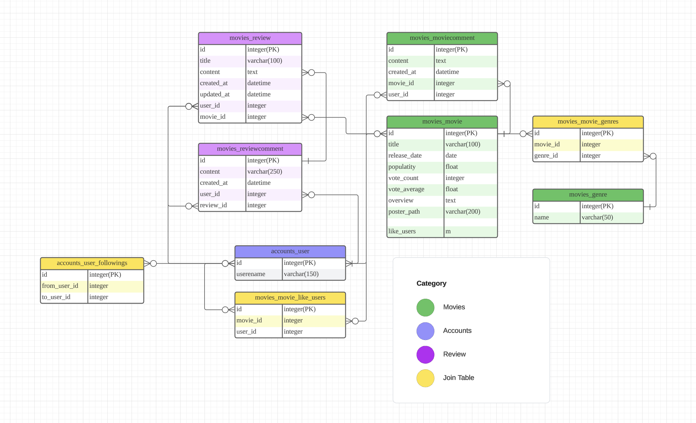

# MovieSignal - 영화 추천 커뮤니티 웹 서비스
## 0. 개발 환경
- Python 3.9.x
- Django 4.2.x
- Node.js LTS
- Vue.js 3.x
---
## 1. 팀 정보
- 팀장 : 조수훈
    - 주요 역할 - Back-end(Django) 구현
- 팀원 : 심우석
    - 주요 역할 - Front-end(Vue.js) 구현
---

## 2. 프로젝트 구조 - Django DRF(Back-end) & Vue.js(Front-end)
## 2-1. Django DRF
### 2-1-1. 기본 구조
</img>

Back-end Django Frame Work의 앱 구조는, 유저에 관련된 ```accounts``` app과 영화와 관련된 ```movies``` app을 사용한다.
### 2-1-2. 데이터베이스 ERD

### 2-1-3. Model
- accounts/models.py
    ``` from django.db import models
        from django.contrib.auth.models import AbstractUser
        from imagekit.models import ProcessedImageField
        from imagekit.processors import ResizeToFill

        class User(AbstractUser):
            followings = models.ManyToManyField('self', symmetrical=False,  related_name='followers')
            username = models.CharField(max_length=50, unique=True)
            nickname = models.CharField(max_length=15)
            profile_pic = ProcessedImageField(
                blank = True,
                upload_to = 'profile/images',
                processors = [ResizeToFill(300, 300)],
                format = 'JPEG',
                options = {'quality':90},
                )
- movies/models.py
    ``` from django.db import models
        from django.conf import settings


        class Genre(models.Model):
            name = models.CharField(max_length=50)

        class Movie(models.Model):
            title = models.CharField(max_length=100)
            release_date = models.DateField()
            popularity = models.FloatField()
            vote_count = models.IntegerField()
            vote_average = models.FloatField()
            overview = models.TextField()
            poster_path = models.CharField(max_length=200)
            genres = models.ManyToManyField(Genre)
            like_users = models.ManyToManyField(settings.AUTH_USER_MODEL, related_name='like_movies')
            
        class MovieComment(models.Model):
            user = models.ForeignKey(settings.AUTH_USER_MODEL, on_delete=models.CASCADE)
            movie = models.ForeignKey(Movie, on_delete=models.CASCADE)
            content = models.CharField(max_length=250)
            created_at = models.DateTimeField(auto_now_add=True)

        class Review(models.Model):
            user = models.ForeignKey(settings.AUTH_USER_MODEL, on_delete=models.CASCADE)
            movie = models.ForeignKey(Movie, on_delete=models.CASCADE)
            title = models.CharField(max_length=100)
            content = models.TextField()
            created_at = models.DateTimeField(auto_now_add=True)
            updated_at = models.DateTimeField(auto_now=True)

        class ReviewComment(models.Model):
            user = models.ForeignKey(settings.AUTH_USER_MODEL, on_delete=models.CASCADE)
            review = models.ForeignKey(Review, on_delete=models.CASCADE)
            content = models.CharField(max_length=250)
            created_at = models.DateTimeField(auto_now_add=True)

### 2-1-4. 데이터베이스 생성
> TMDB Api를 이용하여 초기 영화 데이터 생성했다.

- 초기 데이터 dump

    ``` $ python manage.py dumpdata movies.Movie --indent 4 > movies.json ```
- 데이터 load

    ``` $ python manage.py loaddata movies/fixtures/movies.json ```

## 2-2. Vue.js
### 2-2-1. Main
- Main 화면에서 TMDB Api로 받아온 현재 인기 영화 Top10을 소개한다. 소개 카드에서 바로 예고편 영상을 조회할 수 있도록 YouTube Api를 활용하였다.
- Weather Api를 함께 활용하여 날씨와 장르 알고리즘을 미리 설계하여, 오늘의 날씨를 조회하고 매치되는 장르에 대한 영화를 랜덤으로 한 작품 소개한다.
 
 
### 2-2-2. Navbar 
- Login을 하게 되면 Login, Signup 버튼이 가려지고, 유저 이름의 버튼이 보여진다. 유저 이름의 버튼으로 onMouse하면 프로필로 이동하는 네비게이션과 로그아웃 버튼이 나온다.
 
 
 
### 2-2-3. Movie List
- 데이터베이스에 있는 영화 목록을 조회할 수 있다. 영화 제목을 검색하면 해당 영화를 찾을 수 있는 검색창을 만들었다.
  
  
### 2-2-4. Movie Detail
- 영화 목록에서 카드를 클릭하면, 해당 영화의 상세정보를 조회할 수 있다. 영화를 나의 좋아요 목록에 저장할 수 있는 pick기능을 구현하였다.
  
  
- 영화 상세정보에 댓글을 작성할 수 있다. 댓글을 작성한 사용자의 이름를 클릭하면, 사용자 프로필 페이지를 방문할 수 있다.
- TMDB Api를 이용해 해당 영화와 같은 장르의 영화를 추천한다.
  
- 해당 영화에 작성된 리뷰를 조회할 수 있다. 작성된 리뷰가 없는 경우, 리뷰를 작성할 수 있는 폼으로 이동하는 버튼을 확인할 수 있다.
### 2-2-5. Review List / Review Create
- 사용자는 로그인을 하면 영화 리스트에 있는 영화를 선택하여 리뷰 글을 작성할 수 있다. 다른 사용자들이 작성한 리뷰를 전체 조회할 수 있다.
  
### 2-2-6. Review Detail
- 리뷰 목록에서 카드를 클릭하면 해당 리뷰의 상세정보를 조회할 수 있다.
  
- 로그인한 사용자 본인이 작성한 글일 경우, 리뷰를 수정 및 삭제할 수 있도록 했다.
- 리뷰를 작성한 사용자의 프로필 페이지로 이동할 수 있는 버튼을 만들었다.
- 리뷰에 댓글을 작성할 수 있다. 댓글을 작성한 사용자의 이름을 클릭하면, 사용자 프로필 페이지를 방문할 수있다.
 
### 2-2-7. Profile
- 사용자의 프로필 페이지에서 사용자를 팔로우/언팔로우 할 수 있는 기능을 구현하였다. 팔로우 중인 사용자의 경우 언팔로우 버튼이, 언팔로우 중인 사용자의 경우 팔로우 버튼이 보이도록 했다.
- 프로필 주인의 팔로우 유저 목록과 팔로잉 유저 목록을 확인할 수 있다.
- 프로필 페이지의 주인인 사용자가 pick한 영화의 목록을 조회할 수 있다.
- 프로필 페이지의 주인인 사용자가 작성한 리뷰를 조회할 수 있다.
- 
- 
### 2-2-8. Search
- Navbar에 영화 정보를 검색할 수 있는 검색창을 만들었다. Youtube Api를 연결하였다.
 

## 3. 목표 서비스 구현 및 실제 구현 정도
- 목표했던 영화 정보 조회
- 리뷰를 작성하고 의견을 나눌 수 있는 커뮤니티 서비스
- 사용자간 팔로우 기능
- 날씨와 장르에 맞는 영화 추천 알고리즘

목표했던 서비스 중 위 서비스를 구현하였다.
잘 구현하지 못해 아쉬웠던 서비스는, 유저 정보를 커스텀하는 서비스였다.
유저 정보에 프로필 사진을 넣거나 닉네임을 설정하고 프로필 페이지를 커스텀하는 기능을 구현하지 못해 아쉬웠다.
유저 정보를 더 다양하게 커스텀할 수 있다면, 날씨 및 성별에 맞는 영화를 추천하는 알고리즘을 구현하고 싶다.

